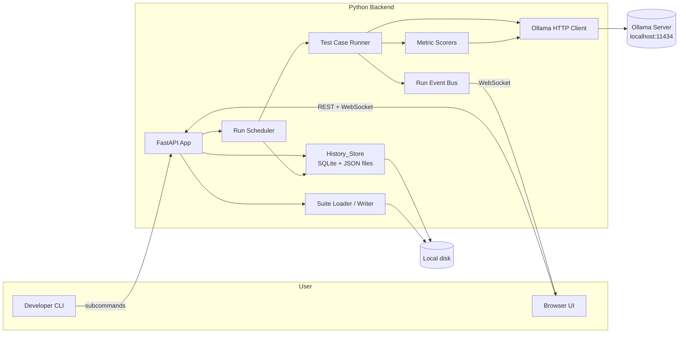
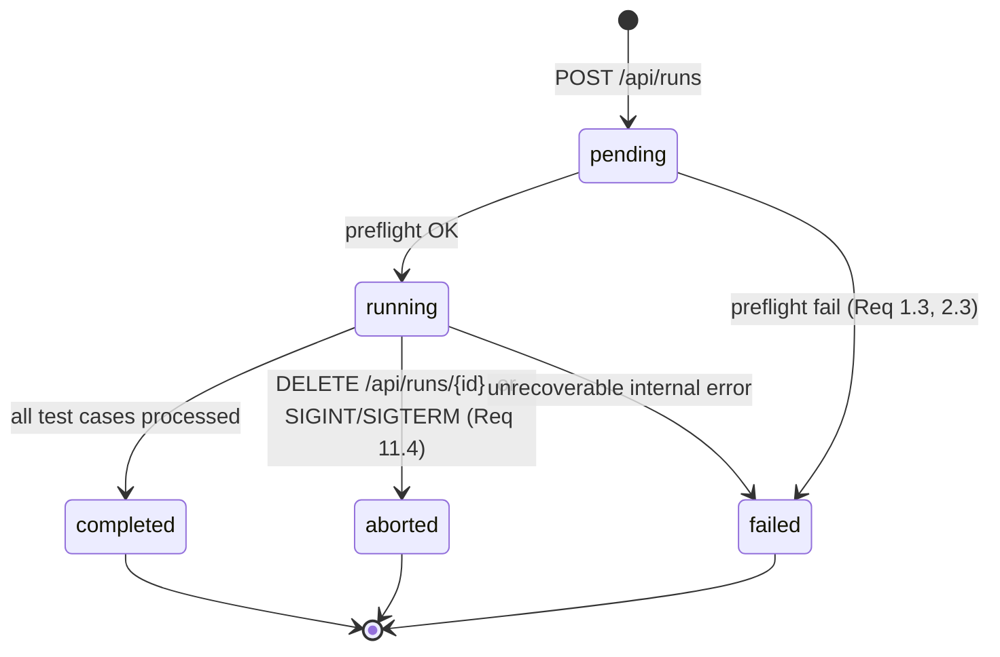
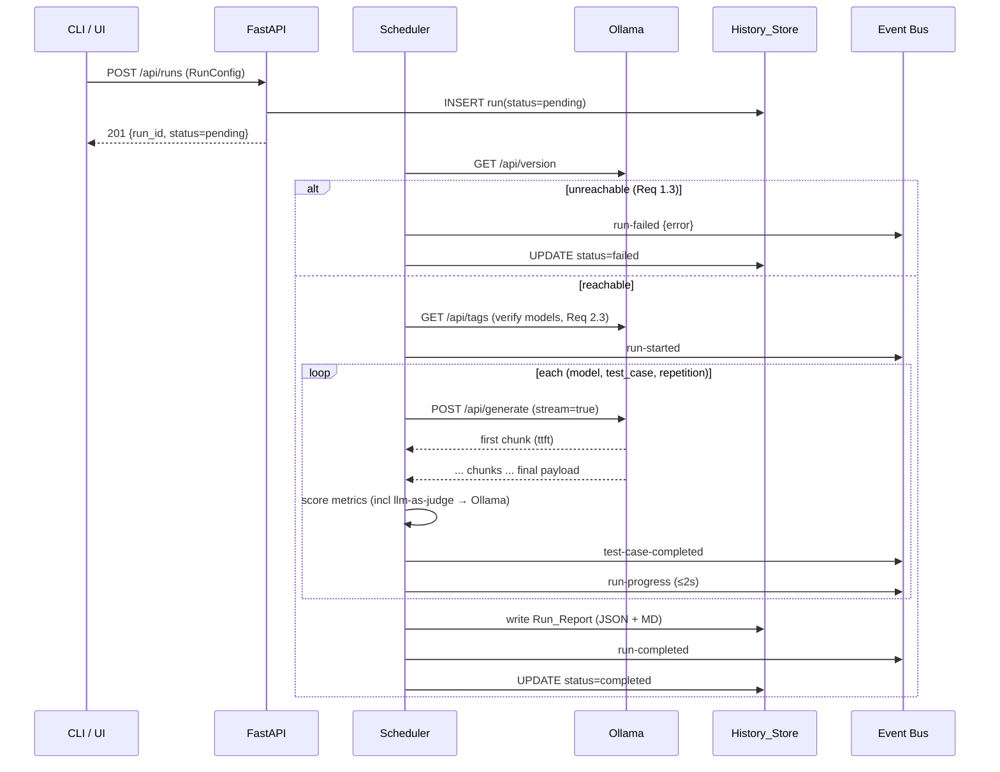

# Design Document

## Overview

The Ollama Model Evaluator is a two-component local application: a Python Backend that orchestrates evaluations against an Ollama server, and a React Web UI that drives and visualises the Backend. The Backend is delivered as a single Python package that exposes both a CLI (`list-models`, `run`, `compare`, `validate-suite`, `serve`) and an HTTP API. The UI is a Vite-built SPA that calls the Backend's HTTP API and subscribes to a WebSocket stream of Run_Events.

Primary design goals:

1. **Correctness by construction.** Evaluation_Suites and Run_Reports are defined by strict Pydantic models. Parsing, pretty-printing, and scoring are pure functions that are heavily property-tested.
2. **Reproducibility.** Every Run_Report captures the exact Config_File, the Ollama model digests, Backend version, and per-execution Performance_Metrics.
3. **Observability during Runs.** The Backend maintains an append-only in-memory event buffer per Run and fans events out over WebSocket with full replay for late subscribers.
4. **Local-first.** No cloud dependencies. The History_Store is SQLite plus a flat-file `runs/{run_id}/` directory for report artifacts, making results easy to inspect, diff, and back up.

### Technology choices

| Concern | Choice | Rationale |
|---|---|---|
| Backend language | Python 3.11+ | Async I/O, rich ecosystem for ML tooling, strong YAML/JSON support, excellent PBT via Hypothesis. |
| HTTP framework | FastAPI + Uvicorn | Native `async`, built-in OpenAPI generation (Req 13.7), Pydantic integration, first-class WebSocket support (Req 14). |
| Data validation | Pydantic v2 | Single source of truth for API schemas, Config_File, Evaluation_Suite, and Run_Report; generates OpenAPI and JSON Schema. |
| Ollama client | `httpx.AsyncClient` | Streaming response support needed for time-to-first-token (Req 6.1), connection pooling for concurrency (Req 5.5), configurable timeouts (Req 1.4). |
| YAML | `ruamel.yaml` (round-trip mode) | Preserves key order and comments enough for the Req 4.3 round-trip property to hold on realistic inputs. |
| Metadata store | SQLite via `aiosqlite` | Local, zero-config, transactional. Indexed queries for history filters (Req 12.4, 16.2). |
| Report artifact store | Flat JSON + Markdown files under `runs/{run_id}/` | Req 8.1 requires writing Run_Reports to an output directory; storing canonical JSON there and indexing in SQLite keeps files human-readable while queries remain fast. |
| Streaming transport | WebSocket (`/api/runs/{run_id}/events`) | Req 14 needs bidirectional-capable, low-latency delivery with replay. WebSocket in FastAPI maps 1:1 to the Run_Event model and supports client disconnects cleanly (Req 14.7). |
| UI framework | React 18 + TypeScript + Vite | Widest browser support (Req 15.1), mature ecosystem, static build served by the Backend or any web server. |
| UI state / data fetching | TanStack Query + Zustand | Query caches REST responses (Models, Suites, history); Zustand holds the transient Run_Event stream state per Run. |
| UI WebSocket client | Native `WebSocket` with a reconnect wrapper | Implements Req 15.8 retry-with-backoff and Req 15.9 polling fallback. |
| PBT | Hypothesis (backend), fast-check (UI) | Required for the Correctness Properties in this design. |

### Repository layout

```
ollama-model-evaluator/
├── backend/
│   ├── pyproject.toml
│   ├── src/ollama_evaluator/
│   │   ├── __init__.py        # __version__
│   │   ├── cli.py             # Typer-based CLI (Req 10)
│   │   ├── config.py          # Config_File Pydantic model
│   │   ├── models.py          # Pydantic models for Test_Case, Evaluation_Suite, Run_Report, events
│   │   ├── suites/
│   │   │   ├── loader.py      # YAML/JSON loading (Req 3, 4)
│   │   │   ├── writer.py      # Pretty-printer (Req 4.2)
│   │   │   ├── mmlu.py        # MMLU adapter
│   │   │   ├── hellaswag.py   # HellaSwag adapter
│   │   │   ├── truthfulqa.py  # TruthfulQA (MC1) adapter
│   │   │   ├── gsm8k.py       # GSM8K adapter
│   │   │   ├── humaneval.py   # HumanEval adapter (response-capture only in v1)
│   │   │   └── huggingface.py # Generic HuggingFace Datasets loader (HFRef/HFFieldMap)
│   │   ├── ollama/
│   │   │   ├── client.py      # httpx-based Ollama client
│   │   │   └── types.py       # Ollama API response models
│   │   ├── metrics/
│   │   │   ├── base.py        # Metric interface
│   │   │   ├── builtin.py     # exact-match, regex-match, contains, json-schema-valid, length-range
│   │   │   └── judge.py       # llm-as-judge
│   │   ├── runner/
│   │   │   ├── scheduler.py   # Concurrency-limited test execution (Req 5)
│   │   │   ├── run_state.py   # In-memory run state + event log
│   │   │   └── aggregate.py   # Mean/stddev (Req 7.6), aggregates (Req 8.2)
│   │   ├── history/
│   │   │   ├── store.py       # SQLite-backed History_Store (Req 12)
│   │   │   └── schema.sql
│   │   ├── api/
│   │   │   ├── app.py         # FastAPI app factory
│   │   │   ├── rest.py        # REST endpoints (Req 13)
│   │   │   ├── events_ws.py   # WebSocket stream (Req 14)
│   │   │   └── errors.py      # Uniform error_code/message envelopes
│   │   └── compare.py         # Comparison_Report (Req 9)
│   └── tests/
│       ├── unit/
│       ├── property/          # Hypothesis tests, one test per design property
│       └── integration/       # Fake Ollama server fixture
│
├── ui/
│   ├── package.json
│   ├── vite.config.ts
│   ├── src/
│   │   ├── main.tsx
│   │   ├── api/               # Generated from OpenAPI + WebSocket client
│   │   ├── routes/
│   │   │   ├── NewRun.tsx     # Req 15.3
│   │   │   ├── RunDetail.tsx  # Req 15.5–15.10, 16.3
│   │   │   ├── History.tsx    # Req 16.1–16.2
│   │   │   └── Compare.tsx    # Req 16.4
│   │   ├── stream/
│   │   │   └── runEvents.ts   # Reconnecting WebSocket, polling fallback
│   │   └── state/             # Zustand stores, Query hooks
│   └── tests/                 # Vitest + fast-check
│
└── shared/
    ├── openapi.yaml           # Served from /openapi.json by FastAPI; file is the committed snapshot
    ├── evaluation-suite.schema.json
    └── run-report.schema.json
```

`shared/openapi.yaml` and the JSON Schemas are regenerated from the Pydantic models by a small dev script; CI asserts the committed copies are up to date.

## Architecture

### High-level components



### Run lifecycle (state machine)



Every state transition emits exactly one terminal Run_Event (Req 14.5). `preflight` covers Ollama connectivity verification (Req 1.2), Model availability check (Req 2.3), optional `pull-missing-models` (Req 2.4), and Evaluation_Suite validation (Req 3.5).

### Concurrency model

- Each Run owns a single `asyncio.Semaphore(concurrency)` that gates Ollama_Server calls (Req 5.5).
- Test_Case executions are scheduled as `asyncio.Task`s by `scheduler.py`. The scheduler maintains three queues per Run: pending, in-progress, completed, which directly feeds the `run-progress` event payload (Req 14.4).
- A single `asyncio.create_task` drives a 2-second periodic progress tick (Req 14.4); that tick is cancelled on terminal transition.
- Graceful shutdown (Req 11.4): SIGINT/SIGTERM sets `Run.cancel_requested = True`, the scheduler stops pulling from the pending queue, and `asyncio.wait_for(gather(...), timeout=30)` bounds the drain. On timeout, outstanding executions are marked `error`.
- Only one Run is `running` at a time in v1. Additional Runs submitted while one is running are queued as `pending` and picked up when the previous Run reaches a terminal state. This keeps the Ollama_Server's memory pressure predictable and avoids interleaving Performance_Metrics measurements.

### Event bus

Per-Run event delivery is implemented as an append-only in-memory `list[RunEvent]` plus an `asyncio.Condition` that WebSocket subscribers await on.

- **Producers** (scheduler, runner) hold the `RunState` for a Run and call `run_state.append_event(event)`. This append also persists the event to SQLite in the same transaction as any state change (Req 12.2, 14.5).
- **Consumers** (WebSocket handler) on subscribe:
  1. Snapshot the current `events` list and send each event in order as a JSON frame (Req 14.6 replay).
  2. Loop: `await condition.wait()`, then send any events appended since the last index.
  3. Exit when a terminal event has been delivered.
- A dropped consumer (Req 14.7) simply stops consuming; other consumers and the producer are unaffected. The Run's execution is never blocked by slow subscribers because events are appended without awaiting consumers.

### Dataset sources

An Evaluation_Suite is the Backend's one and only input-for-execution abstraction: every Test_Case the runner sees is a fully-materialised `TestCase` object. The Backend supports four ways to obtain those objects, each implemented as an **adapter** that produces an `EvaluationSuite`:

1. **Hand-authored Evaluation_Suites (YAML/JSON).** The primary, first-class form (Req 3.1–3.5, 4.x). Files live under `suites_dir`. Nothing in this workflow reaches the network.
2. **Built-in public-benchmark adapters.** One Python module per benchmark under `backend/src/ollama_evaluator/suites/`. Each adapter is a pure function `source_rows → EvaluationSuite` plus a CLI subcommand to materialise it to disk. The v1 set:

   | Adapter | Canonical source | Prompt template | Answer extraction | Metric(s) | Row → TestCase mapping |
   |---|---|---|---|---|---|
   | `mmlu` | HF `cais/mmlu`, config=subject, split=`test` (and `dev` for few-shot) | `"Answer with a single letter A, B, C, or D.\nQuestion: {question}\nA) {A}\nB) {B}\nC) {C}\nD) {D}\nAnswer:"` | First `[ABCD]` character in response | `regex-match` on `^\s*([ABCD])\b`, `expected_output = answer_letter` | One suite per subject; `id = f"mmlu/{subject}/{row_index}"`; `tags = [subject, "mmlu"]` |
   | `hellaswag` | HF `Rowan/hellaswag`, split=`validation` | `"Choose the most likely continuation.\nContext: {ctx}\nA) {endings[0]}\nB) {endings[1]}\nC) {endings[2]}\nD) {endings[3]}\nAnswer:"` | First `[ABCD]` in response | `regex-match` + `expected_output = "ABCD"[int(label)]` | `id = f"hellaswag/{ind}"`; `tags = ["hellaswag", activity_label]` |
   | `truthfulqa` | HF `truthful_qa`, config=`multiple_choice`, split=`validation` | `"Question: {question}\n" + enumerated choices + "\nAnswer:"` (MC1 single-correct form) | First letter token | `regex-match` + `expected_output` = letter of the index where `mc1_targets.labels == 1` | `id = f"truthfulqa/mc1/{row_index}"`; `tags = ["truthfulqa", "mc1", category]`. LLM-as-judge variant is documented but **not** the default metric in v1 because it introduces a second model dependency. |
   | `gsm8k` | HF `openai/gsm8k`, config=`main`, split=`test` | `"Solve the following problem. End your response with 'Final answer: <number>'.\nProblem: {question}\nSolution:"` | Extract last `####` block or last integer after `Final answer:`; fall back to last signed integer in response | `regex-match` with pattern `(?i)(?:final answer:\s*|####\s*)(-?\d[\d,]*(?:\.\d+)?)` plus a numeric-equality comparator that strips `,` and compares as `Decimal` | `expected_output` is the gold numeric string from the reference answer's `#### N` block; `tags = ["gsm8k", "math"]` |
   | `humaneval` | HF `openai_humaneval`, split=`test` | `"Complete the following Python function. Return only the function body.\n{prompt}"` | Response capture only | **v1: `response-capture` metric** (always `passed=true`, `score=0.0`, `details.response` stored for external grading). Optional `humaneval-exec` metric is a design placeholder — see "HumanEval execution mode" below. | `expected_output = canonical_solution`; `reference_data = {"test": test, "entry_point": entry_point}`; `tags = ["humaneval", "code"]` |

3. **Generic HuggingFace Datasets adapter (`suites/huggingface.py`).** Lets users target any HF dataset by a reference `repo_id[:config][:split]` plus a **field map** that projects dataset rows into `TestCase`s:

   ```yaml
   # suites_dir/custom-hf.yaml
   kind: huggingface
   name: my-custom-qa
   hf_ref: "squad:plain_text:validation"    # repo_id[:config][:split]
   limit: 500                                # optional row cap
   seed: 42                                  # optional sampling seed for deterministic sub-sampling
   dataset_mode: local                       # optional; overrides Config_File default
   field_map:
     prompt: "question"
     expected_output: "answers.text[0]"     # dotted path + index access
     system_prompt: null                    # optional; literal null means "omit"
     choices: null                          # used only for MC datasets
     tags_from: ["category"]                # optional: copy these columns into tags
   metrics:
     - name: exact-match
       case_sensitive: false
       trim: true
   defaults:
     temperature: 0.0
   ```

   Loading this file does **not** perform I/O in the usual `load_suite` path; it produces a lazy `HuggingFaceSuiteSpec` that the runner materialises at Run start. Materialisation applies the field map to each row, validates that all declared prompt/answer fields are present and non-`None`, and raises a `SuiteValidationError` pointing at the offending row index on failure.

4. **Custom adapters (future).** The adapter interface is intentionally public so third parties can register their own `kind:` values via a Python entry point. Out of scope for v1.

#### Local vs Remote mode

All non-hand-authored adapters (public benchmarks and the generic HF loader) support two modes:

- **`local` mode.** The adapter consumes files already on disk. Users run a one-time CLI conversion (see the `convert` subcommand family below) to download and materialise the dataset into the suites directory or a dedicated cache. At Run time the adapter performs **no network I/O**; failures are disk-level only. This is the default for deterministic CI and air-gapped use.
- **`remote` mode.** The adapter streams directly from the HuggingFace Hub at Run time using the `datasets` library (which caches under `hf_cache_dir`). Rows are pulled, mapped to `TestCase`s, then fed to the scheduler. The first run populates the HF cache; subsequent runs are effectively offline against the same cache. Network failures during materialisation fail the preflight with `error_code = dataset_fetch_failed`.

Two new `ConfigFile` fields control this:

```python
class ConfigFile(BaseModel):
    # existing fields...
    dataset_mode: Literal["local", "remote"] = "local"   # global default
    hf_cache_dir: Path | None = None                     # defaults to $HF_HOME or ~/.cache/huggingface
```

Any suite file (adapter-produced or hand-authored HF reference) may carry a `dataset_mode:` field that overrides the global default for that suite only. Hand-authored suites with inline `test_cases:` ignore both settings because they have no external source.

The preflight step (before the `run-started` event) materialises every remote-mode adapter. This guarantees the Property 6 planned-execution count is known before the first `test-case-completed` event and that network problems surface as a clean `run-failed` event instead of interleaved per-test errors.

#### HumanEval execution mode

HumanEval's canonical metric is `pass@k`, which requires **executing the model's generated Python code** against held-out unit tests. Running arbitrary LLM-generated code is a security risk (file system access, network, resource exhaustion) and must not be done in-process. In v1 the Backend ships with only the safe, non-executing path:

- **`response-capture` metric (default, v1).** Records the response verbatim in `MetricResult.details.response`, always passes, and stores `reference_data.test` and `reference_data.entry_point` on the `TestCase` so an external grader can score later. The Run still produces meaningful Performance_Metrics and lets the UI compare models qualitatively.
- **`humaneval-exec` metric (deferred, documented).** Would run each response in a sandbox (process isolation, seccomp or container, CPU/memory/time caps, no network, no filesystem writes outside a scratch dir) and compute pass@1. This is documented as a post-v1 extension; the placeholder metric name is reserved so later versions can add it without a config break.

The v1 approach is equivalent to "HumanEval is a response-capture benchmark"; the data model is already general enough to host the real metric later without changing `TestCase` or `EvaluationSuite`.

### Preflight → execute → finalize flow



## Components and Interfaces

### 1. Ollama Client (`ollama/client.py`)

A thin async wrapper around `httpx.AsyncClient`.

```python
class OllamaClient:
    def __init__(self, base_url: str, timeout_s: float = 120.0): ...
    async def version(self) -> str: ...                      # Req 1.2
    async def list_models(self) -> list[OllamaModelInfo]: ...  # Req 2.1, 2.5
    async def pull_model(self, name: str) -> AsyncIterator[PullProgress]: ...  # Req 2.4
    async def generate(
        self,
        model: str,
        prompt: str,
        system: str | None,
        options: GenerateOptions,  # temperature, num_predict, stop
    ) -> AsyncIterator[GenerateChunk]: ...                   # streamed for ttft
```

`generate()` always uses Ollama's streaming response format. The first chunk's timestamp minus the request-dispatch timestamp produces time-to-first-token (Req 6.1). The final chunk carries `prompt_eval_count`, `eval_count`, and `total_duration` which populate the remaining Performance_Metrics (Req 6.2–6.4). If a field is missing, it is stored as `None` (Req 6.5).

### 2. Suite Loader / Writer (`suites/loader.py`, `suites/writer.py`)

```python
def load_suite(path: Path) -> EvaluationSuite: ...   # Req 3.1, 3.2, 4.1
def dump_suite(suite: EvaluationSuite, fmt: Literal["yaml", "json"]) -> str: ...  # Req 4.2
def discover_suites(dir: Path) -> list[EvaluationSuite]: ...  # Req 3.1
```

The loader:
- Detects format by file extension (`.yaml`, `.yml` → YAML; `.json` → JSON) and validates via Pydantic.
- Wraps Pydantic `ValidationError` into a `SuiteValidationError` that carries `path`, optional `test_case_id`, and `missing_field` / `message` for Req 3.5 and Req 4.4 (including line numbers from `ruamel.yaml`'s parser).

The writer guarantees the round-trip property of Req 4.3 / Design Property 1 by always emitting canonicalised output (sorted keys, two-space indent, block-style YAML, no comments) so that the equivalence relation is "Pydantic-model equality" rather than "byte equality".

### 3. Benchmark adapters (`suites/mmlu.py`, `hellaswag.py`, `truthfulqa.py`, `gsm8k.py`, `humaneval.py`)

Each public-benchmark adapter is a Python module exporting:

```python
ADAPTER_NAME: str                  # e.g. "mmlu"
DEFAULT_HF_REF: HFRef              # canonical HuggingFace reference
def rows_to_suite(rows: Iterable[dict], opts: AdapterOptions) -> EvaluationSuite: ...
def materialise(mode: Literal["local","remote"], opts: AdapterOptions, cache_dir: Path | None) -> EvaluationSuite: ...
```

`materialise` dispatches on `mode`: in `local` mode it reads JSONL/Parquet under `cache_dir / adapter_name / ...`; in `remote` mode it delegates to `huggingface.stream_rows(DEFAULT_HF_REF)` and reuses the same `rows_to_suite` transformer. This is the key consistency invariant behind Property 44 below.

Prompt templates, answer extraction, metric selection, and the row → `TestCase` mapping for each adapter are defined in the Dataset sources table in Architecture.

Each adapter is exposed via the CLI (see "CLI surface" below). All adapters are pure `dict → EvaluationSuite` transformations and are covered by the same round-trip property as hand-authored suites (Property 1).

### 3a. Generic HuggingFace loader (`suites/huggingface.py`)

The generic loader is the building block the benchmark adapters delegate to in `remote` mode and is also directly available to users via `kind: huggingface` suite files.

```python
class HFRef(BaseModel):
    repo_id: str
    config: str | None = None
    split: str | None = None                       # "train" | "validation" | "test" | ...
    revision: str | None = None                    # commit hash or branch; defaults to "main"

class HFFieldMap(BaseModel):
    prompt: str                                    # required; dotted path into the row
    expected_output: str | None = None
    system_prompt: str | None = None
    choices: str | None = None                     # list-valued path for MC datasets
    tags_from: list[str] = []

class HFSuiteSpec(BaseModel):
    kind: Literal["huggingface"] = "huggingface"
    name: str
    hf_ref: HFRef
    field_map: HFFieldMap
    limit: int | None = None
    seed: int | None = None
    dataset_mode: Literal["local", "remote"] | None = None   # None → inherit ConfigFile default
    metrics: list[MetricConfig]
    defaults: GenerationDefaults = Field(default_factory=GenerationDefaults)

def materialise_hf(spec: HFSuiteSpec, mode: Literal["local","remote"], cache_dir: Path | None) -> EvaluationSuite: ...
def stream_rows(ref: HFRef, mode: Literal["local","remote"], cache_dir: Path | None) -> Iterable[dict]: ...
```

Field-map resolution supports dotted paths and bracketed list indices (`answers.text[0]`), returns a typed `FieldValue` per row, and raises `FieldMapError(row_index, field, reason)` if a declared field is missing, `None`, or the wrong type. `materialise_hf` is pure in `(spec, rows)` so the mapping is testable without network I/O.

### 3b. CLI surface for adapters

The CLI gains a new `convert` subcommand family plus a `--dataset-mode` flag on `run`:

```text
ollama-evaluator convert mmlu         --source <dir|hf> --output <dir> [--subjects all|...]
ollama-evaluator convert hellaswag    --source <dir|hf> --output <dir>
ollama-evaluator convert truthfulqa   --source <dir|hf> --output <dir> [--form mc1|mc2]
ollama-evaluator convert gsm8k        --source <dir|hf> --output <dir>
ollama-evaluator convert humaneval    --source <dir|hf> --output <dir>
ollama-evaluator convert hf           --hf-ref repo_id[:config][:split] --field-map <file.yaml> --output <dir>
ollama-evaluator run  ... [--dataset-mode local|remote] [--hf-cache-dir <dir>]
```

All `convert` variants write ordinary Evaluation_Suite YAML files under `--output`, so after conversion the suites are indistinguishable from hand-authored ones and can be committed, diffed, and filtered by tag.

### 4. Metric framework (`metrics/`)

```python
class Metric(Protocol):
    name: str
    def score(self, response: str, test_case: TestCase, ctx: MetricContext) -> MetricResult: ...

@dataclass(frozen=True)
class MetricResult:
    score: float               # numeric, metric-defined range
    passed: bool               # Req 7.4
    threshold: float | None    # metric-specific threshold used
    details: dict[str, Any]    # e.g., matched groups, judge rationale
```

Built-in metrics (Req 7.1):

| Metric | Inputs | Score | Pass condition |
|---|---|---|---|
| `exact-match` | `expected_output`, `case_sensitive?`, `trim?` | 1.0 on match else 0.0 | score == 1.0 |
| `regex-match` | `pattern`, `flags?` | 1.0 on match else 0.0 | score == 1.0 |
| `contains` | `substrings[]`, `mode: any \| all` | fraction of matched substrings | score ≥ threshold (default 1.0) |
| `json-schema-valid` | `schema` | 1.0 if valid else 0.0 | score == 1.0 |
| `length-range` | `min?`, `max?` (chars or tokens) | 1.0 if in range else 0.0 | score == 1.0 |
| `llm-as-judge` | `rubric`, `judge_model`, `scale_max?` | normalised float in [0, 1] | score ≥ threshold (default 0.7) |
| `response-capture` | — | always `0.0` | always pass (records response in `details.response` for external graders; used by HumanEval v1) |
| `humaneval-exec` *(reserved, not implemented in v1)* | `test`, `entry_point`, sandbox config | `1.0` if sandboxed execution passes all unit tests else `0.0` | score == 1.0 |

All metrics live in a registry (`metrics/__init__.py`) keyed by `name`. Errors raised during scoring are caught at the runner boundary (Req 7.5). Per-repetition aggregation (mean, stddev) is computed in `runner/aggregate.py` over the per-repetition `MetricResult.score` values (Req 7.6).

### 5. Runner and Scheduler (`runner/`)

```python
class RunScheduler:
    def __init__(self, run: Run, store: HistoryStore, ollama: OllamaClient, bus: RunEventBus): ...
    async def execute(self) -> None: ...   # drives the full lifecycle
```

Scheduling algorithm:
1. Expand configured `(model, test_case, repetition)` cross product into a pending queue.
2. Acquire `semaphore(concurrency)` per dispatch.
3. For each execution: call `OllamaClient.generate()`, capture Performance_Metrics, then run every configured Metric.
4. Append `test-case-completed` to the event bus and persist the result row to SQLite within the same transaction.
5. On terminal state, call `reports.write_artifacts(run_id, run_report)` which writes `runs/{run_id}/report.json` and `runs/{run_id}/report.md` atomically (write-temp-then-rename).

Retry policy (Req 11.1):
- Only network errors (`httpx.ConnectError`, `httpx.ReadError`, 502/503/504) are retried.
- Max additional attempts default `2`, delay `1s * 2**attempt`, jittered ±20%.
- Timeouts (Req 1.5) are not retried; they record a `timeout` status.
- Ollama 4xx errors (including model-not-loaded) are not retried; they record `error`.

### 6. History_Store (`history/store.py`)

SQLite schema (tables):

```sql
CREATE TABLE runs (
  run_id TEXT PRIMARY KEY,        -- UUIDv7 or UUIDv4
  status TEXT NOT NULL,           -- pending|running|completed|aborted|failed
  started_at TEXT,                -- ISO-8601 UTC
  ended_at TEXT,
  backend_version TEXT NOT NULL,
  ollama_version TEXT,
  config_json TEXT NOT NULL,      -- Config_File contents
  report_path TEXT                -- runs/{run_id}/report.json, set on terminal
);
CREATE INDEX idx_runs_status_started ON runs(status, started_at);

CREATE TABLE run_models (
  run_id TEXT NOT NULL REFERENCES runs(run_id) ON DELETE CASCADE,
  model_name TEXT NOT NULL,
  model_digest TEXT,
  parameter_size TEXT,
  PRIMARY KEY (run_id, model_name)
);

CREATE TABLE run_suites (
  run_id TEXT NOT NULL REFERENCES runs(run_id) ON DELETE CASCADE,
  suite_name TEXT NOT NULL,
  PRIMARY KEY (run_id, suite_name)
);

CREATE TABLE run_events (
  run_id TEXT NOT NULL REFERENCES runs(run_id) ON DELETE CASCADE,
  seq INTEGER NOT NULL,
  event_type TEXT NOT NULL,
  ts TEXT NOT NULL,
  payload_json TEXT NOT NULL,
  PRIMARY KEY (run_id, seq)
);

CREATE TABLE test_case_results (
  run_id TEXT NOT NULL REFERENCES runs(run_id) ON DELETE CASCADE,
  model_name TEXT NOT NULL,
  suite_name TEXT NOT NULL,
  test_case_id TEXT NOT NULL,
  repetition INTEGER NOT NULL,
  status TEXT NOT NULL,           -- pass|fail|error|timeout
  response_text TEXT,
  error_message TEXT,
  ttft_ms REAL,
  total_ms REAL,
  prompt_tokens INTEGER,
  response_tokens INTEGER,
  tokens_per_second REAL,
  metrics_json TEXT NOT NULL,     -- list[MetricResult]
  PRIMARY KEY (run_id, model_name, suite_name, test_case_id, repetition)
);
```

`HistoryStore` is the only module that writes to SQLite. All writes happen in a single `aiosqlite.Connection` configured with `PRAGMA journal_mode=WAL` for concurrent reads.

Corrupted-record handling (Req 12.6): `list_runs()` iterates rows and wraps per-row Pydantic validation in `try/except`. Unreadable rows are logged with their `run_id` and skipped.

### 7. REST API (`api/rest.py`)

| Method | Path | Req | Purpose |
|---|---|---|---|
| `GET` | `/api/health` | — | Liveness probe |
| `GET` | `/api/models` | 2.1, 13.2 | List Models on the Ollama_Server |
| `GET` | `/api/suites` | 13.2 | List discovered Evaluation_Suites |
| `GET` | `/api/suites/{name}` | 13.2 | Full Evaluation_Suite contents |
| `POST` | `/api/runs` | 13.3 | Create a Run; body = RunConfig; returns `{run_id, status}` |
| `GET` | `/api/runs` | 12.4, 13.2, 16.1 | List Run identifiers; filters: `model`, `suite`, `status`, `since`, `until` |
| `GET` | `/api/runs/{id}` | 13.2, 16.3 | Run_Report (JSON) |
| `GET` | `/api/runs/{id}/report.md` | 16.5 | Run_Report (Markdown) |
| `DELETE` | `/api/runs/{id}` | 12.5 | Delete a Run from the History_Store |
| `POST` | `/api/runs/{id}/cancel` | 13.4, 15.10 | Cancel an in-progress Run |
| `GET` | `/api/compare?a={id}&b={id}` | 9, 13.2 | Comparison_Report |
| `GET` | `/openapi.json` | 13.7 | OpenAPI 3.1 document |

Error envelope (Req 13.5, 13.6):

```json
{ "error_code": "run_not_found", "message": "Run 'abc' does not exist", "field": null }
```

`error_code` values are enumerated in `api/errors.py` so both the UI and tests can switch on them.

### 8. WebSocket stream (`api/events_ws.py`)

Endpoint: `GET /api/runs/{run_id}/events` (WebSocket upgrade).

Frame format: text frames, each a JSON object matching a `RunEvent` variant.

Handshake:
1. Client opens WebSocket; server validates `run_id` exists (closes with code 4404 and reason `"run_not_found"` if not).
2. Server subscribes to the run's in-memory bus and replays all persisted events for the run from `run_events` in `seq` order (Req 14.6).
3. Server forwards new events as they are appended.
4. Server sends the terminal event and closes with code 1000 (Req 14.5).

Ping/pong: server sends WebSocket ping every 15s; missing pong for 30s closes the connection. The client's reconnect logic (see UI) handles re-subscription; replay guarantees no events are missed.

### 9. UI routes

| Route | Component | Req |
|---|---|---|
| `/runs/new` | `NewRun` | 15.3, 15.4 |
| `/runs/:id` | `RunDetail` | 15.5–15.10, 16.3, 16.6 |
| `/history` | `History` | 16.1, 16.2, 16.4 (entry), 16.5 |
| `/compare?a=…&b=…` | `Compare` | 16.4 |

`RunDetail` is driven by a `useRunEvents(runId)` hook that wraps `RunEventStream`:

```ts
class RunEventStream {
  constructor(runId: string, onEvent: (e: RunEvent) => void, onStatus: (s: "connected"|"disconnected"|"polling") => void)
  // attempts WebSocket connect; on close with non-1000, retries up to 5 times with backoff 1s, 2s, 4s, 8s, 16s (Req 15.8)
  // after 5 failures, switches to polling GET /api/runs/:id every 5s (Req 15.9)
}
```

The UI derives all aggregate counters (passed / failed / error / timeout / % complete) from the event stream rather than from a separate summary endpoint, so reconnections are fully reconciled by replay.

## Data Models

Key Pydantic models. All use `model_config = ConfigDict(extra="forbid")` and `frozen=True` where feasible.

### Evaluation_Suite

```python
class TestCase(BaseModel):
    id: str                              # unique within suite (Req 3.3)
    prompt: str
    system_prompt: str | None = None
    expected_output: str | None = None
    reference_data: dict[str, Any] | None = None
    tags: list[str] = Field(default_factory=list)
    temperature: float | None = None
    max_tokens: int | None = None
    stop_sequences: list[str] = Field(default_factory=list)
    metrics: list[MetricConfig]          # Req 3.3: at least one

class EvaluationSuite(BaseModel):
    name: str
    version: str = "1.0"
    description: str | None = None
    defaults: GenerationDefaults = Field(default_factory=GenerationDefaults)
    test_cases: list[TestCase]           # ids unique (validator)
```

### Config_File and RunConfig

```python
class RunConfig(BaseModel):
    models: list[str]                    # Req 2.2
    suites: list[str]                    # Evaluation_Suite names
    tag_filter: list[str] = []           # Req 3.6
    repetitions: int = 1                 # Req 5.2
    concurrency: int = 1                 # Req 5.5
    defaults: GenerationDefaults = Field(default_factory=GenerationDefaults)
    pull_missing_models: bool = False    # Req 2.4
    retry_max_attempts: int = 2          # Req 11.1
    judge_model: str | None = None       # used if any metric is llm-as-judge

class ConfigFile(BaseModel):
    ollama_base_url: str = "http://localhost:11434"
    ollama_timeout_s: float = 120.0
    suites_dir: Path
    output_dir: Path
    dataset_mode: Literal["local", "remote"] = "local"   # default for all adapter-backed suites
    hf_cache_dir: Path | None = None                     # None → $HF_HOME or ~/.cache/huggingface
    run: RunConfig
```

### Run_Report

```python
class MetricResult(BaseModel):
    name: str
    score: float
    passed: bool
    threshold: float | None = None
    details: dict[str, Any] = {}
    error: str | None = None             # Req 7.5

class TestCaseResult(BaseModel):
    model: str
    suite: str
    test_case_id: str
    repetition: int
    status: Literal["pass", "fail", "error", "timeout"]
    response: str | None
    error_message: str | None
    performance: PerformanceMetrics
    metrics: list[MetricResult]

class PerformanceMetrics(BaseModel):
    ttft_ms: float | None                # Req 6.1, 6.5
    total_ms: float                      # Req 6.2
    prompt_tokens: int | None            # Req 6.3, 6.5
    response_tokens: int | None          # Req 6.3, 6.5
    tokens_per_second: float | None      # Req 6.4

class ModelAggregate(BaseModel):
    model: str
    passed: int
    failed: int
    errored: int
    timed_out: int
    mean_ttft_ms: float | None
    mean_total_ms: float
    mean_tokens_per_second: float | None
    metric_aggregates: dict[str, MetricAggregate]  # mean, stddev per metric (Req 7.6)

class RunReport(BaseModel):
    run_id: str
    backend_version: str
    ollama_version: str | None
    started_at: datetime
    ended_at: datetime | None
    status: Literal["pending", "running", "completed", "aborted", "failed"]
    config: ConfigFile
    models: list[ModelInfo]              # Req 2.5, 8.4
    results: list[TestCaseResult]
    aggregates: list[ModelAggregate]     # Req 8.2
    error_summary: list[ErrorSummaryEntry]  # Req 11.3
```

### Run_Event

```python
class BaseRunEvent(BaseModel):
    run_id: str
    seq: int
    ts: datetime

class RunStartedEvent(BaseRunEvent):
    type: Literal["run-started"] = "run-started"
    planned_executions: int

class RunProgressEvent(BaseRunEvent):
    type: Literal["run-progress"] = "run-progress"
    completed: int
    in_progress: int
    pending: int

class TestCaseCompletedEvent(BaseRunEvent):
    type: Literal["test-case-completed"] = "test-case-completed"
    result: TestCaseResult

class RunCompletedEvent(BaseRunEvent):
    type: Literal["run-completed"] = "run-completed"
    summary: RunSummary

class RunAbortedEvent(BaseRunEvent):
    type: Literal["run-aborted"] = "run-aborted"
    reason: str

class RunFailedEvent(BaseRunEvent):
    type: Literal["run-failed"] = "run-failed"
    error_code: str
    message: str

RunEvent = Annotated[
    RunStartedEvent | RunProgressEvent | TestCaseCompletedEvent
    | RunCompletedEvent | RunAbortedEvent | RunFailedEvent,
    Field(discriminator="type"),
]
```

### Comparison_Report

```python
class MetricDiff(BaseModel):
    model: str
    metric: str
    mean_a: float
    mean_b: float
    diff: float                          # b - a

class PerformanceDiff(BaseModel):
    model: str
    mean_tokens_per_second_a: float | None
    mean_tokens_per_second_b: float | None
    mean_total_ms_a: float
    mean_total_ms_b: float
    tps_diff: float | None
    total_ms_diff: float

class ComparisonReport(BaseModel):
    run_a: str
    run_b: str
    metric_diffs: list[MetricDiff]       # Req 9.2
    performance_diffs: list[PerformanceDiff]  # Req 9.3
```

`/api/compare` returns HTTP 400 with `error_code="no_common_dimensions"` if `metric_diffs` and `performance_diffs` would both be empty (Req 9.4).


## Correctness Properties

*A property is a characteristic or behavior that should hold true across all valid executions of a system — essentially, a formal statement about what the system should do. Properties serve as the bridge between human-readable specifications and machine-verifiable correctness guarantees.*

Each property is accompanied by the acceptance criteria it validates. After the per-criterion prework, logically redundant properties were merged; the 44 properties below are the consolidated set (Properties 1–41 derived from the original requirements; Properties 42–44 cover the design-level contract for benchmark and HuggingFace adapters added during the Dataset Sources design review).

### Property 1: Evaluation_Suite round-trip

*For any* valid `EvaluationSuite` object `s` and any format `f ∈ {yaml, json}`, `load_suite_from_string(dump_suite(s, f), f) == s`.

**Validates: Requirements 3.2, 3.4, 4.1, 4.2, 4.3**

### Property 2: Evaluation_Suite validation

*For any* candidate suite dictionary `d`, `load_suite(d)` succeeds if and only if `d` has a `name`, every `test_case` has a unique `id` within the suite, a non-empty `prompt`, and a non-empty `metrics` list; when it fails, the raised `SuiteValidationError` identifies the suite path, the offending test case id (when present), and the missing or invalid field.

**Validates: Requirements 3.3, 3.5**

### Property 3: Suite discovery

*For any* directory containing a set `F` of files, `discover_suites(dir)` returns exactly the set of `EvaluationSuite` objects produced by loading each file in `F` whose extension is `.yaml`, `.yml`, or `.json`.

**Validates: Requirements 3.1**

### Property 4: Tag and name filtering

*For any* `EvaluationSuite` `s` and any `RunConfig.tag_filter` and `RunConfig.suites`, the test cases selected for execution equal the set `{tc ∈ s.test_cases | s.name ∈ config.suites and (config.tag_filter == [] or tc.tags ∩ config.tag_filter ≠ ∅)}`.

**Validates: Requirements 3.6**

### Property 5: Missing-model preflight

*For any* inventory of Ollama models `A` and any requested model set `R`, starting a Run with `pull_missing_models=false` aborts before any `test-case-completed` event is emitted if and only if `R \ A ≠ ∅`; when aborted, the emitted `run-failed` event lists the missing models as exactly `R \ A`.

**Validates: Requirements 2.3**

### Property 6: Execution count and coverage

*For any* `RunConfig` with models `M`, selected test cases `K`, and `repetitions = R`, a successful Run dispatches exactly `|M| · |K| · R` Ollama generate calls, with exactly one call per `(model, test_case_id, repetition)` tuple.

**Validates: Requirements 5.1**

### Property 7: Generation parameter resolution

*For any* `TestCase` `tc` and `RunConfig.defaults` `d`, the `GenerateOptions` passed to the Ollama client equals `{field: tc.field if tc.field is not None else d.field}` for every generation field (`temperature`, `max_tokens`, `stop_sequences`).

**Validates: Requirements 5.3, 5.4**

### Property 8: Concurrency bound

*For any* `RunConfig.concurrency = C`, the maximum number of simultaneously in-flight Ollama generate calls observed during the Run is `≤ C`.

**Validates: Requirements 5.5**

### Property 9: Scheduler failure isolation

*For any* Run and any subset `F` of planned executions that fail with a timeout or Ollama 5xx/4xx error, every execution in `F` appears in `Run_Report.results` with status in `{timeout, error}` and every execution not in `F` appears with status in `{pass, fail}`, and the total number of results equals the planned execution count.

**Validates: Requirements 1.5, 5.6**

### Property 10: Tokens-per-second arithmetic

*For any* execution with `response_tokens = n` and `total_ms = t > 0`, `PerformanceMetrics.tokens_per_second == n / (t / 1000)`; if `response_tokens` is `None` or `t == 0`, `tokens_per_second` is `None`.

**Validates: Requirements 6.4**

### Property 11: Optional performance fields

*For any* Ollama final-chunk payload missing any subset of `prompt_eval_count`, `eval_count`, or `total_duration`, the resulting `PerformanceMetrics` object is constructed successfully, the fields sourced from the missing keys are `None`, and the test case status is not `error` solely because of the missing fields.

**Validates: Requirements 6.3, 6.5**

### Property 12: Built-in metric correctness

*For any* response `r`, test case configuration `tc`, and built-in metric `m ∈ {exact-match, regex-match, contains, json-schema-valid, length-range}`, `m.score(r, tc)` returns a `MetricResult` whose `score` is a `float`, whose `passed` is a `bool`, and whose `(score, passed)` values agree with the metric-specific rules stated in the Components section (exact equality; regex search; substring fraction; JSON-Schema validation; length-in-range).

**Validates: Requirements 7.1, 7.3, 7.4**

### Property 13: llm-as-judge score normalisation

*For any* judge-model output string of the form `"Score: X/Y"` with `0 ≤ X ≤ Y ≤ 100`, the `llm-as-judge` metric returns `score == X/Y`; *for any* malformed output, the metric returns a `MetricResult` with `error` set and `passed == False`.

**Validates: Requirements 7.2**

### Property 14: Metric error isolation

*For any* configured metric list `[m1 … mk]` where an arbitrary subset `E` raise during scoring, the resulting `TestCaseResult.metrics` list has exactly `k` entries in input order; each `m_i ∈ E` has `MetricResult.error != None`, and each `m_i ∉ E` is scored normally.

**Validates: Requirements 7.5**

### Property 15: Repetition aggregates

*For any* list of per-repetition scores `[s_1 … s_R]` recorded for a `(model, test_case, metric)` triple, the per-triple aggregate has `mean == fmean([s_1 … s_R])` and `stddev == pstdev([s_1 … s_R])`.

**Validates: Requirements 7.6**

### Property 16: Run_Report completeness

*For any* successfully completed Run, the produced `Run_Report` contains: a non-empty `run_id`; `backend_version`; `ollama_version`; `started_at` and `ended_at` with `ended_at ≥ started_at`; the full `config` as submitted; a `models` entry per evaluated model carrying `tag`, `digest`, and `parameter_size`; a `results` entry per `(model, test_case_id, repetition)` execution; and an `aggregates` entry per evaluated model with per-metric aggregates and performance means.

**Validates: Requirements 2.5, 8.2, 8.4**

### Property 17: Markdown report contents

*For any* `Run_Report` `r`, the Markdown rendering of `r` contains each model name in `r.models`, each suite name in `r.config.run.suites`, and the column headers `Model`, `Passed`, `Failed`, `Mean tokens/s`, and `Mean total ms`.

**Validates: Requirements 8.3**

### Property 18: Run_Report round-trip

*For any* valid `RunReport` `r`, `RunReport.model_validate_json(r.model_dump_json()) == r`.

**Validates: Requirements 8.5**

### Property 19: Comparison over intersection

*For any* pair of `Run_Reports` `A` and `B`, let `K_metric = {(model, metric)}` present in both and `K_perf = {model}` present in both. Then `compare(A, B).metric_diffs` is keyed exactly by `K_metric` with each entry satisfying `diff == mean_b - mean_a`; `compare(A, B).performance_diffs` is keyed exactly by `K_perf`; and `compare(A, B)` raises `NoCommonDimensionsError` if and only if `K_metric == ∅` and `K_perf == ∅`.

**Validates: Requirements 9.2, 9.3, 9.4**

### Property 20: CLI exit code ↔ failure presence

*For any* Run invoked via the `run` subcommand, the process exit code is `0` if every test case result has `status == pass`, and non-zero otherwise.

**Validates: Requirements 10.2, 10.3**

### Property 21: Retry limit and terminal error

*For any* execution that encounters a sequence of `n` consecutive retriable network errors followed by success or exhaustion, the total number of Ollama attempts equals `min(n + 1, retry_max_attempts + 1)`; if all attempts fail the test case status is `error` with `error_message` equal to the last error, and the Run continues past the failing execution.

**Validates: Requirements 11.1, 11.2**

### Property 22: Error summary completeness

*For any* Run, `Run_Report.error_summary` contains exactly one entry per `TestCaseResult` whose `status ∈ {error, timeout}`, each carrying the model name, test case id, repetition, and `error_message`.

**Validates: Requirements 11.3**

### Property 23: History persistence across restart

*For any* sequence of Run persistence operations, reopening the `HistoryStore` against the same database file and report directory returns, for every `run_id`, a `Run_Report` equal to the one written.

**Validates: Requirements 12.1**

### Property 24: Terminal-event-before-status ordering

*For any* Run that reaches a terminal state, the sequence of store operations contains an `append_event(terminal_event)` and a `write_report(run_id, ...)` strictly before the `update_run_status(run_id, terminal_status)` call.

**Validates: Requirements 12.2**

### Property 25: Unique run identifiers

*For any* `n ≥ 1` sequential calls to `create_run()`, the returned `run_id` values are pairwise distinct.

**Validates: Requirements 12.3**

### Property 26: History filter semantics

*For any* set of persisted runs `R` and any filter `(model?, suite?, status?, since?, until?)`, `list_runs(filter)` returns exactly the runs in `R` that satisfy every non-`None` field of the filter.

**Validates: Requirements 12.4**

### Property 27: History delete

*For any* persisted run `r`, after `delete_run(r.run_id)`, `get_run(r.run_id)` returns a not-found result and `list_runs()` does not include `r.run_id`; other runs are unaffected.

**Validates: Requirements 12.5**

### Property 28: History skips corrupted records

*For any* `HistoryStore` containing `N` records of which an arbitrary subset `C` have corrupted `payload_json`, `list_runs()` returns exactly the `N − |C|` non-corrupted records and emits a warning log entry for each record in `C`.

**Validates: Requirements 12.6**

### Property 29: 404 error envelope

*For any* API endpoint that references a `run_id`, `suite_name`, or `model_name` that does not exist, the HTTP response has status `404` and a JSON body `{error_code: string, message: string}` where `error_code ∈ {run_not_found, suite_not_found, model_not_found}`.

**Validates: Requirements 13.5**

### Property 30: 400 field identification

*For any* request body that fails Pydantic validation against the endpoint's schema, the HTTP response has status `400` and a JSON body `{error_code: "validation_failed", field: string, message: string}` where `field` is the dotted path to the first failing field in document order.

**Validates: Requirements 13.6**

### Property 31: Event log bookends

*For any* Run that transitions through `running` and reaches a terminal state, the persisted event log begins with exactly one `run-started` event and ends with exactly one of `{run-completed, run-aborted, run-failed}`, and no events follow the terminal event.

**Validates: Requirements 14.2, 14.5**

### Property 32: test-case-completed bijection

*For any* Run, the multiset of `test-case-completed` events emitted during the Run corresponds bijectively to the set of executed `(model, test_case_id, repetition)` tuples, and each event payload carries the `TestCaseResult` for that tuple (test case id, model, metric scores, performance metrics).

**Validates: Requirements 14.3**

### Property 33: Progress cadence

*For any* Run that is in the `running` state for a duration `D > 2s`, consecutive `run-progress` events are separated by at most `2s + ε` of wall-clock time (where `ε` is the scheduler tick tolerance), and the last `run-progress` event occurs strictly before the terminal event.

**Validates: Requirements 14.4**

### Property 34: Multi-subscriber replay and isolation

*For any* Run and any schedule of subscribe / receive / disconnect actions across `n` subscribers, each subscriber that remains connected through the terminal event receives the canonical event sequence `[e_1, e_2, … e_T]` in order with no gaps and no duplicates, regardless of the actions of the other subscribers.

**Validates: Requirements 14.6, 14.7**

### Property 35: UI form → RunConfig body

*For any* valid selection of models, suites, repetitions, concurrency, and optional tag filters in the New-Run view, the body submitted to `POST /api/runs` has fields equal to those selections with no additional fields.

**Validates: Requirements 15.3**

### Property 36: UI 400-error field mapping

*For any* `{error_code: "validation_failed", field: f, message: m}` response to `POST /api/runs`, the New-Run view displays `m` as a sibling of the input bound to `f`.

**Validates: Requirements 15.4**

### Property 37: UI event-stream state reducer

*For any* well-formed sequence of `RunEvent` values `[e_1 … e_n]`, applying the UI's pure `reduce(runEventState, e_i)` fold produces the same derived state (`status`, `percent_complete`, counters of `{passed, failed, error, timeout}`, per-execution table rows, terminal error message) as the reference specification fold defined in the Components section; this holds for any suffix obtained by dropping and replaying a prefix (replay determinism).

**Validates: Requirements 15.6, 15.7, 16.3, 16.6**

### Property 38: UI reconnect schedule and polling fallback

*For any* connection-failure pattern, the UI attempts at most `5` reconnects with delays `[1s, 2s, 4s, 8s, 16s]` in order; if all five attempts fail, it switches to polling `GET /api/runs/:id` at a `5s` interval and marks the stream as `polling`.

**Validates: Requirements 15.8, 15.9**

### Property 39: UI history row completeness

*For any* list of run summaries returned by the Backend, each rendered history row contains the run's `started_at`, `status`, each model name, each suite name, and the aggregate pass rate.

**Validates: Requirements 16.1**

### Property 40: UI filter query round-trip

*For any* filter selection `(model?, suite?, status?, since?, until?)` made in the history view, the query string produced by the UI decodes back to the same filter when parsed by the Backend's filter parser.

**Validates: Requirements 16.2**

### Property 41: UI comparison table rendering

*For any* `ComparisonReport` `c`, the comparison view renders exactly `|c.metric_diffs|` rows in the metric table and exactly `|c.performance_diffs|` rows in the performance table, each row containing the model name, metric name (where applicable), both means, and the signed difference.

**Validates: Requirements 16.4**

### Property 42: Adapter output is a valid Evaluation_Suite

*For any* benchmark adapter `a ∈ {mmlu, hellaswag, truthfulqa, gsm8k, humaneval}`, any adapter options `o`, and any sequence of well-formed source rows `R` for that adapter, `a.rows_to_suite(R, o)` returns an `EvaluationSuite` `s` that (i) satisfies Property 2's validation rules (non-empty name, unique test-case ids, non-empty prompts, non-empty `metrics`) and (ii) satisfies Property 1's round-trip property in both `yaml` and `json` formats. The same holds for the generic HuggingFace loader: `materialise_hf(spec, mode, cache_dir)` returns an `s` with the same guarantees whenever `spec.field_map` is applicable to every row.

**Validates: Design contract that adapters produce first-class Evaluation_Suites; reinforces Requirements 3.3, 4.1, 4.3**

### Property 43: Local/remote mode equivalence

*For any* adapter `a` (or HF spec), any `HFRef` `ref`, and any `cache_dir` that has been populated from `ref`, the `EvaluationSuite` produced by `a.materialise("local", opts, cache_dir)` is equal to the one produced by `a.materialise("remote", opts, cache_dir)` up to `TestCase` identity: the two suites have the same `name`, the same ordered list of `TestCase` ids, and each paired `TestCase` has equal `prompt`, `system_prompt`, `expected_output`, `reference_data`, `tags`, and `metrics`. In particular, the set of planned executions a Run would schedule is identical under the two modes.

**Validates: Design contract that `dataset_mode` is a transport concern, not a semantic one.**

### Property 44: HuggingFace field-map totality and injectivity

*For any* `HFSuiteSpec` `spec` and any sequence of rows `R` such that every declared path in `spec.field_map` resolves to a non-`None` value of the correct type in every row, (i) **totality**: `materialise_hf(spec, ...)` produces exactly `min(|R|, spec.limit or |R|)` `TestCase`s with no row silently dropped; (ii) **injectivity on declared fields**: the function `row → (tc.prompt, tc.system_prompt, tc.expected_output, tc.reference_data, tc.tags)` depends only on the columns named in `spec.field_map` and is deterministic — running it twice on the same `R` (with the same `seed`) yields byte-identical `TestCase` payloads. *For any* row in which a declared path fails to resolve, `materialise_hf` raises `FieldMapError(row_index, field, reason)` without producing a partial suite.

**Validates: Design contract for the generic HuggingFace loader; reinforces Requirements 3.3, 3.5**

## Error Handling

### Error taxonomy

All backend errors funnel through a single `AppError` hierarchy so the API envelope and CLI output share vocabulary.

| `error_code` | HTTP | Origin | Handling |
|---|---|---|---|
| `ollama_unreachable` | n/a (preflight) | Connectivity check at Run start | `run-failed` event, run status `failed`, CLI exit 2 (Req 1.3) |
| `model_not_found` | 404 | REST + preflight | Response envelope; run aborts before execution (Req 2.3, 13.5) |
| `suite_not_found` | 404 | REST | Envelope (Req 13.5) |
| `run_not_found` | 404 | REST + WS | Envelope; WS close code 4404 (Req 13.5) |
| `validation_failed` | 400 | Request body validation | Envelope with `field` (Req 13.6) |
| `suite_invalid` | n/a | Suite loading | `SuiteValidationError` carries path + test_case_id + field + line (Req 3.5, 4.4) |
| `no_common_dimensions` | 400 | `/api/compare` | Envelope (Req 9.4) |
| `dataset_fetch_failed` | n/a (preflight) | Remote-mode adapter materialisation | `run-failed` event, run status `failed`, CLI exit 2; message names the `HFRef` and underlying cause |
| `field_map_invalid` | n/a (preflight) | HuggingFace loader | `run-failed` event; message carries row index and offending field path (Property 44) |
| `run_timeout` | n/a | Per test case | Recorded as `timeout` on the result; run continues (Req 1.5) |
| `run_error` | n/a | Per test case | Recorded as `error`; run continues (Req 5.6, 11.2) |
| `metric_error` | n/a | Per metric | Recorded on the `MetricResult`; other metrics continue (Req 7.5) |

### Retry and timeout policy

- **Timeouts (Req 1.5)**: `httpx.Timeout(total=ollama_timeout_s)`; on `TimeoutException` the test case is terminal with status `timeout` — no retry.
- **Retriable errors (Req 11.1)**: `ConnectError`, `ReadError`, HTTP 502/503/504. Delay schedule: `1s · 2^k ± 20% jitter`, up to `retry_max_attempts` additional attempts.
- **Non-retriable**: HTTP 4xx (including `404 model not found` mid-run, which should not normally occur because of preflight), Ollama runtime errors. Recorded as `error` immediately.
- **Preflight failure**: a single attempt only; no retry on preflight so the user gets fast feedback when Ollama isn't running.

### Cancellation and shutdown

- `POST /api/runs/{id}/cancel` sets `RunState.cancel_requested = True`. The scheduler stops pulling from the pending queue; in-flight executions are awaited with a 30s budget (Req 11.4 semantics also applied to user cancellation, for consistency), then the rest are marked `error` with message `"cancelled"`.
- On SIGINT/SIGTERM the same path is used, then the process writes a partial `Run_Report` and exits.
- WebSocket clients always receive a terminal event before the connection closes with code 1000.

### Client-side error handling

- UI maps `error_code → user-visible message` via a central `errorMessages` record.
- Network/WebSocket failures on the Run detail view trigger the reconnect ladder and polling fallback (Properties 37, 38).
- Form submission failures that return `validation_failed` are rendered next to the referenced field (Property 36).

## Testing Strategy

### Overall approach

Testing is split into four layers, each with its own tooling and scope:

1. **Property-based tests (backend)** with Hypothesis. One test file per design property, named `test_property_{n}_{short_name}.py`. Each test is decorated with `@given(...)` generators and runs **at least 100 examples** (configured via `settings(max_examples=100)`). Each test carries a docstring starting with `Feature: ollama-model-evaluator, Property {n}: {property text}` so it can be traced from this design document.
2. **Unit tests (backend)** with pytest for example-level and smoke-level criteria (configuration defaults, specific error messages, CLI flag plumbing).
3. **Integration tests (backend)** with pytest + a `FakeOllamaServer` fixture (an ASGI app that mimics `/api/version`, `/api/tags`, `/api/pull`, and `/api/generate` streaming). Covers signal handling (Req 11.4), full preflight-to-report cycles, and the REST + WebSocket API end-to-end via `httpx.AsyncClient` and `websockets` client.
4. **Property and component tests (UI)** with Vitest + fast-check + Testing Library. Properties 35–41 are implemented here. Component tests cover UI-only example-level criteria.
5. **Adapter and dataset-source tests (backend)** with Hypothesis plus a `FakeHFHub` fixture that yields deterministic row streams. Properties 42–44 are implemented here. `local` mode is tested against converted fixture files written to a tempdir so neither CI nor dev runs touch the HuggingFace Hub.
6. **End-to-end smoke (optional)** with Playwright, gated on availability, for the three required browsers (Req 15.1). If Playwright isn't available in CI, a manual checklist suffices; this layer is not a correctness gate.

### Property test conventions

- Library: Hypothesis for backend, fast-check for UI. Implementing PBT from scratch is forbidden.
- Minimum `max_examples=100` per property.
- Generators for the core domain models (`TestCase`, `EvaluationSuite`, `RunConfig`, `RunReport`, `RunEvent`) live in `tests/property/generators.py` so properties share them.
- Each property test file is tagged with a module-level comment:

  ```python
  # Feature: ollama-model-evaluator, Property 1: Evaluation_Suite round-trip
  ```

  and the primary test function's docstring repeats the property text.
- Generators that need to feed the scheduler use a `FakeOllamaClient` that accepts a `Callable[[model, prompt, options], AsyncIterator[GenerateChunk]]` so each test can inject timing, error, and payload shape without real I/O.

### Non-PBT coverage

The acceptance criteria that were not classified as PROPERTY break down as follows:

- **EXAMPLE / EDGE_CASE** (configuration defaults, specific error messages, single-flag behaviour): covered by unit tests in `tests/unit/`.
- **SMOKE**: covered by a handful of smoke tests (CLI `--help`, OpenAPI doc validity, build-output ES target check for the UI).
- **INTEGRATION**: covered in `tests/integration/` using the `FakeOllamaServer` and FastAPI's `TestClient` / `websockets` client. Includes signal handling (Req 11.4), full run lifecycle via REST + WebSocket (Req 13.1–13.4, 14.1), and the browser-compatibility smoke (Req 15.1).

### Test execution targets

- `pytest -m "not integration"` runs fast (unit + property).
- `pytest -m integration` runs the `FakeOllamaServer` suite.
- `pytest -m "property"` runs only the property-based tests, useful for PBT-only CI jobs.
- `npm test` in `ui/` runs Vitest in run-mode (no watchers).

### Coverage policy

Coverage is measured by `pytest-cov` for the backend and `vitest --coverage` for the UI. Targets:

- Lines: ≥ 85% overall, ≥ 95% in `metrics/`, `runner/`, `suites/`, and `history/`.
- Every built-in metric has its own dedicated property test plus at least two example tests.
- Every REST endpoint has at least one example-level happy-path test and one example-level error-path test.

### Test data hygiene

- No real Ollama calls in any CI job; every test uses the in-process `FakeOllamaServer` or `FakeOllamaClient`.
- Each test creates its own `tempdir` for the `HistoryStore` database and report directory; no shared mutable state.
- Hypothesis profiles: `dev` (fast, default), `ci` (100+ examples), `deep` (500+ examples for nightly runs on the round-trip properties P1 and P18).

### Review and approval

This design builds on `requirements.md`, including the newly-added Requirement 17 ("Source Evaluation Suites from Public Benchmarks and HuggingFace Datasets"). The Dataset Sources section above is the design-level elaboration of that requirement, together with Requirement 3. Property-to-requirement mapping updates from this revision:

- **Property 42** (adapter output is a valid Evaluation_Suite) validates Requirements 17.1, 17.2, 17.8 in addition to reinforcing Requirements 3.3, 4.1, 4.3.
- **Property 43** (local/remote mode equivalence) validates Requirement 17.10.
- **Property 44** (HuggingFace field-map totality and injectivity) validates Requirements 17.2 and 17.7.
- Requirement 17.9 (HumanEval v1 is response-capture only, `humaneval-exec` is reserved) is enforced by the metric registry design in Components §4 and the adapter implementation in Components §3; it is covered by example-level unit tests rather than a property.
- Requirements 17.3, 17.4, 17.5, 17.6 (dataset_mode default, per-suite override, preflight materialisation, `dataset_fetch_failed` abort) are covered by integration tests against the `FakeHFHub` fixture described in Testing Strategy.

No existing Property 1–41 was weakened by the addition; all 17 requirements in `requirements.md` map to one or more of Properties 1–44 or to example/integration/smoke tests tabulated in the prework.
