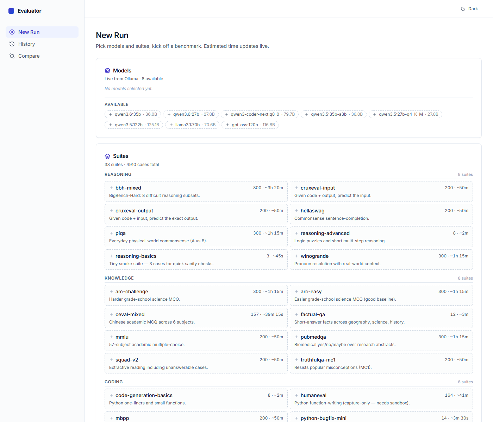
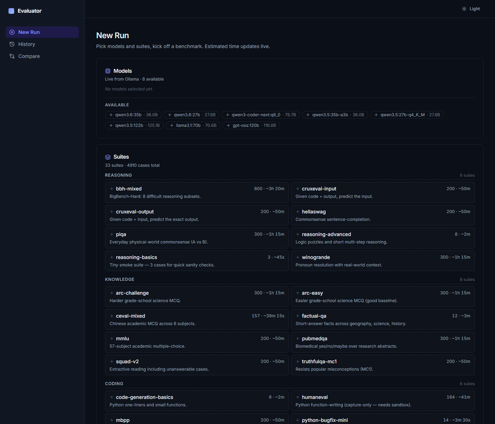
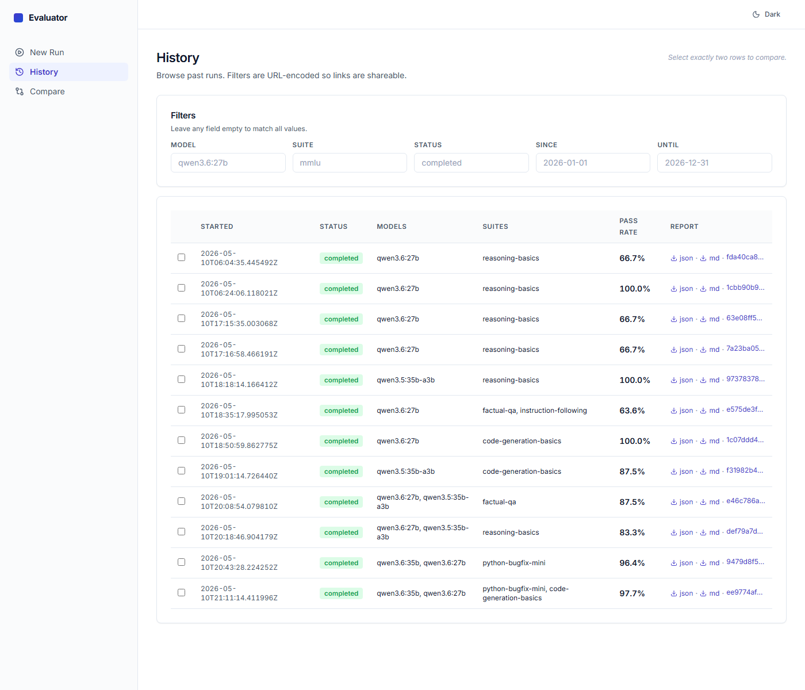
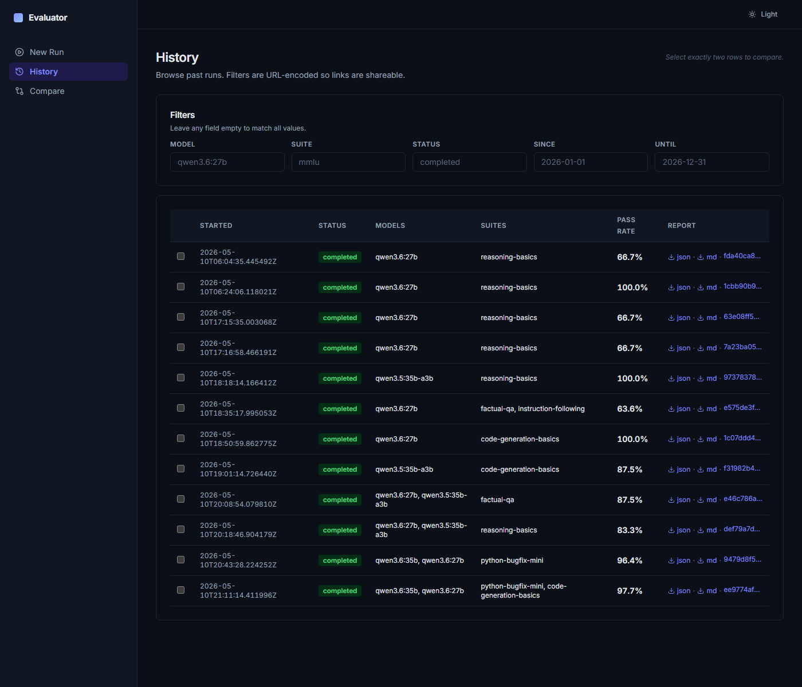

# Ollama Model Evaluator

Benchmark local LLMs running under [Ollama](https://ollama.com) — score quality, measure speed, and compare models side by side, all offline.

[](LICENSE)
[](https://www.python.org)
[](#testing)
[](#testing)

---

## Screenshots

> The UI has a categorised suite picker, live progress, per-model breakdown tables, and full light/dark themes.

|   | Light | Dark |
|---|---|---|
| **New Run** |  |  |
| **History** |  |  |

---

## Why this exists

You're running one or more LLMs locally through Ollama (say `llama3:8b`, `qwen3.6:27b`, `gpt-oss:120b`). You want to answer questions like:

- **How fast** is each model on my hardware? tokens/s, time-to-first-token.
- **How accurate** is it on the kinds of prompts I actually care about?
- **Which model should I pick** for this task?
- **Did the newer model regress** on anything the older one got right?

This tool runs a suite of prompts through each model, scores the responses, measures throughput, and produces a JSON + Markdown report plus a live web UI.

Everything runs on your own hardware. Nothing is sent to a cloud service.

---

## Feature summary

- 🧪 **33 ready-made evaluation suites · 4 910 test cases** across reasoning, knowledge, coding, math, instruction-following, multilingual, long-context, safety, and judge-scored open-ended tasks.
- 📊 **Public-benchmark adapters** — MMLU · HellaSwag · TruthfulQA · GSM8K · HumanEval · BigBench-Hard · ARC · PIQA · WinoGrande · C-Eval · MATH-500 · MBPP · SQuAD v2 · IFEval · MT-Bench · PubMedQA · CRUXEval · Spider.
- 🌐 **Web UI** with a categorised suite picker, live progress over WebSocket, per-model-× per-suite breakdown tables, light/dark theme, URL-encoded filters, and a diff view.
- 🧰 **CLI + REST + WebSocket** — same features from your terminal, your CI pipeline, or a custom dashboard.
- 🎯 **Multi-model comparison** — run 2–N models against the same suites; reports surface each model's pass rate independently, not just the aggregate.
- 🛡️ **Safety by design** — metric errors are isolated per test case; runs can be cooperatively cancelled; artefacts write atomically.
- 📦 **One-button install + launch** — `./scripts/start.sh` (or `start.bat` on Windows) brings up Ollama, backend, and UI together.
- ✅ **Extensively tested** — 447 backend tests (unit + property + integration) and 18 UI tests, including 44 Hypothesis / fast-check property tests derived from a formal spec.

---

## Quick start

### Prerequisites

- Python **3.11+**
- Node.js **18+**
- [Ollama](https://ollama.com/download) **0.5+** running on port 11434
- At least one Ollama model pulled (`ollama pull llama3:8b`)

### One-command install + run

```bash
git clone https://github.com/<your-username>/ollama-model-evaluator.git
cd ollama-model-evaluator
./scripts/start.sh            # Linux/macOS
```

or on Windows:

```powershell
.\scripts\start.ps1           # or double-click start.bat
```

The launcher:
1. Runs the installer if `.venv/` or `ui/dist/` are missing.
2. Ensures Ollama is running (or starts it if the CLI is installed).
3. Starts the backend (FastAPI on `:8765`) with the built UI mounted at `/`.
4. Health-checks every service before handing back.

Open <http://localhost:8765/> and submit your first run.

Stop everything later with:

```bash
./scripts/stop.sh             # or Ctrl-C if start is still in the foreground
```

### Install only (no launch)

```bash
./scripts/install.sh          # Linux/macOS
.\scripts\install.ps1         # Windows
```

### Remote deploy (over SSH)

```bash
./scripts/deploy-remote.sh user@host /target/dir
```

Tars the repo, scp's it, runs `install.sh` on the remote, optionally starts the server. See [`docs/USER_MANUAL.md`](docs/USER_MANUAL.md#9-running-remotely-via-ssh) for the full flag list.

---

## How it works

```
┌──────────────────────┐        ┌──────────────────────────────────┐
│   React UI (Vite)    │<─WS──→│  Backend  ·  FastAPI + asyncio   │
│   Tailwind + Radix   │─REST─→│  port 8765                       │
└──────────────────────┘        └────────────┬─────────────────────┘
                                              │
                           ┌──────────────────┼──────────────────┐
                           │                  │                  │
                           ▼                  ▼                  ▼
                 ┌──────────────────┐ ┌──────────────┐ ┌──────────────────┐
                 │  Ollama HTTP     │ │  SQLite       │ │  Evaluation_Suites │
                 │  localhost:11434 │ │  history.db   │ │  YAML / HF adapters│
                 └──────────────────┘ └──────────────┘ └──────────────────┘
```

### The run lifecycle

1. **Preflight** — verifies Ollama is reachable, pulls any missing models (opt-in), and materialises public-benchmark datasets when needed.
2. **Scheduling** — expands `(model, test_case, repetition)` tuples into a pending queue, gated by `concurrency`.
3. **Generation** — streams from Ollama, measuring time-to-first-token and tokens/second per response.
4. **Scoring** — runs every configured metric; a metric error does not fail the test case (per-metric isolation).
5. **Reporting** — writes `report.json`, renders `report.md`, persists to the SQLite history store.
6. **Streaming** — every event (`run-started`, `test-case-completed`, `run-progress`, terminal) is broadcast over WebSocket to connected clients.

### Evaluation suite format

Suites are plain YAML or JSON — easy to author, version-control, and diff. Minimum shape:

```yaml
name: my-suite
test_cases:
  - id: arithmetic-simple
    prompt: "What is 2 + 2? Answer with just the number."
    expected_output: "4"
    metrics:
      - name: regex-match
        params:
          pattern: "\\b4\\b"
```

Built-in metrics: `exact-match`, `regex-match`, `contains`, `json-schema-valid`, `length-range`, `llm-as-judge`, `response-capture`.

### Public benchmark adapters

Materialise any supported benchmark into a standard suite file:

```bash
python -m ollama_evaluator.cli convert mmlu \
  --output examples/suites --limit 200 --seed 42
```

From then on the benchmark looks identical to a hand-authored suite.

### Multi-model reports

Running more than one model in a single submission gives you per-model stats and a model × suite breakdown automatically:

| Model | Passed | Failed | Pass rate | Mean tokens/s |
|---|---|---|---|---|
| `qwen3.5:35b-a3b` | 3 | 0 | **100.0%** | 48.97 |
| `qwen3.6:27b` | 2 | 1 | **66.7%** | 10.54 |

---

## Documentation

- **[User Manual](docs/USER_MANUAL.md)** — hands-on walkthrough (installation, first run, suite authoring, HuggingFace loader, remote SSH, report reading, troubleshooting).
- **[Requirements](.kiro/specs/ollama-model-evaluator/requirements.md)** — functional requirements.
- **[Design](.kiro/specs/ollama-model-evaluator/design.md)** — system design and architecture.
- **[UI style previews](docs/ui-previews/)** — open `docs/ui-previews/index.html` locally to see the three design directions that were evaluated before the final pick.

---

## Usage examples

### Validate a suite (no Ollama needed)

```bash
python -m ollama_evaluator.cli validate-suite examples/suites/reasoning-basics.yaml
# → OK: reasoning-basics (3 test cases)
```

### Run against an Ollama model

```bash
python -m ollama_evaluator.cli --config examples/config.qwen.yaml run
# → Run <id>: 3 executions, passed=2, failed=1, error=0, timeout=0
```

Exit code is `0` iff every test passed, `1` on any failure, `2` on preflight errors — useful for CI pipelines.

### Compare two runs

```bash
python -m ollama_evaluator.cli --config examples/config.qwen.yaml compare <RUN_A> <RUN_B>
```

### Start the HTTP + WebSocket + UI server

```bash
OLLAMA_EVAL_UI_DIR=$PWD/ui/dist \
  python -m ollama_evaluator.cli --config examples/config.qwen.yaml \
  serve --host 0.0.0.0 --port 8765
```

---

## Repository layout

```
.
├── backend/         # Python backend (FastAPI + CLI + 447 tests)
├── ui/              # Vite + React + TypeScript UI (Tailwind + Radix)
├── shared/          # OpenAPI + JSON Schemas shared by both
├── examples/        # 33 evaluation suites + sample configs
├── scripts/         # install / start / stop / deploy helpers
├── docs/            # User manual, screenshots, UI style previews
└── .kiro/specs/     # Requirements, design, task list
```

---

## Testing

```bash
make test                 # All 447 backend tests (~45 s)
make test-unit            # Fastest path
make test-property        # 44 Hypothesis property tests
make test-integration     # FastAPI + fake Ollama
make ui-test              # Vitest
```

The property tests derive from a formal specification in `.kiro/specs/` and exercise invariants like:
- Evaluation_Suite YAML↔JSON round-trip equivalence
- Metric error isolation — one broken metric never fails a test case
- Test-case-completed events bijectively cover executed tuples
- UI event-stream reducer is replay-deterministic

---

## Contributing

Issues and pull requests welcome. Please:

1. Open an issue first for anything bigger than a one-line fix.
2. Add or update tests for new behaviour.
3. Match the existing code style (`ruff` + `mypy` for Python; TypeScript strict for the UI).
4. Run `make test` and `make ui-test` locally before pushing.

---

## License

[MIT](LICENSE) — do what you like, no warranty.

---

## Acknowledgements

- [Ollama](https://ollama.com) for making it effortless to run LLMs locally.
- The open-source benchmark authors — Hendrycks et al. (MMLU), Zellers et al. (HellaSwag), Lin et al. (TruthfulQA), Cobbe et al. (GSM8K), Chen et al. (HumanEval), Suzgun et al. (BBH), Clark et al. (ARC), and many more whose datasets this tool materialises.
- The FastAPI, Pydantic, TanStack Query, Vite, React, Tailwind, Radix UI, and Hypothesis / fast-check communities.
